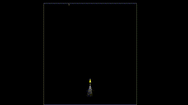
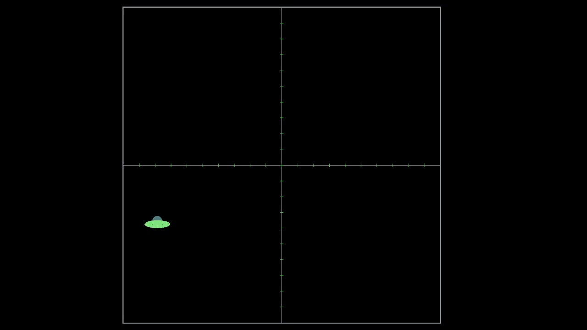
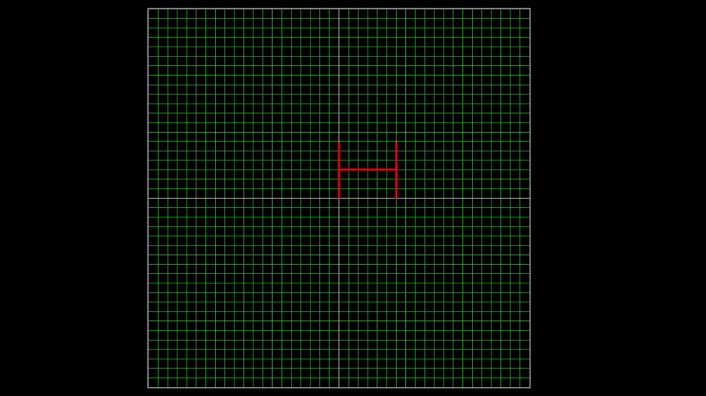
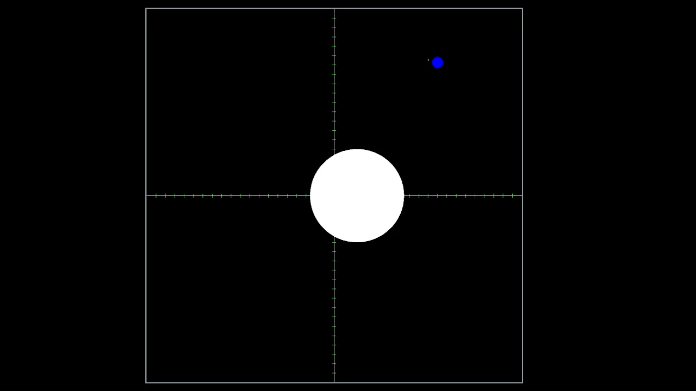
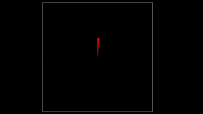
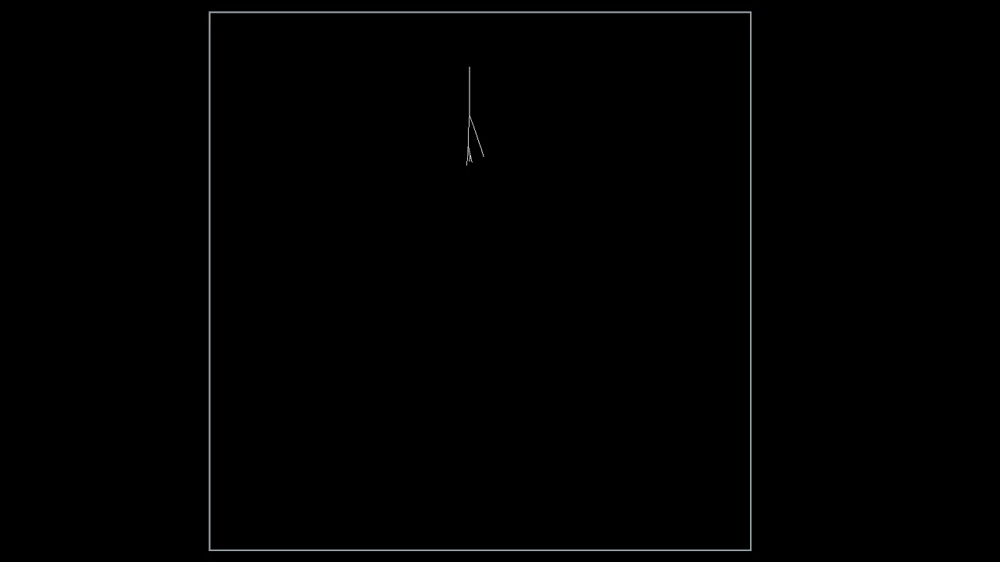

# GraphicsJourney

A collection of graphics experiments and projects.

## 6. Save The Train Game

## 5. Particle Effect: Smoke

## 4. Sky is Blue: Procedural Sky

Creating a procedural sky using Preetham's skylight model.

## 3. UFO: Scaling and Translation

Implemented scaling and translation for a UFO.

## 2. Drawing Tool

A simple drawing tool using mouse point, drag, and click.

## 1. Drawing Circles

*   Sun-Earth Animation
    
*   Circle Like Fan
    

## 0. Lightning Effect

Lightning effect created using `GL_LINES`.

